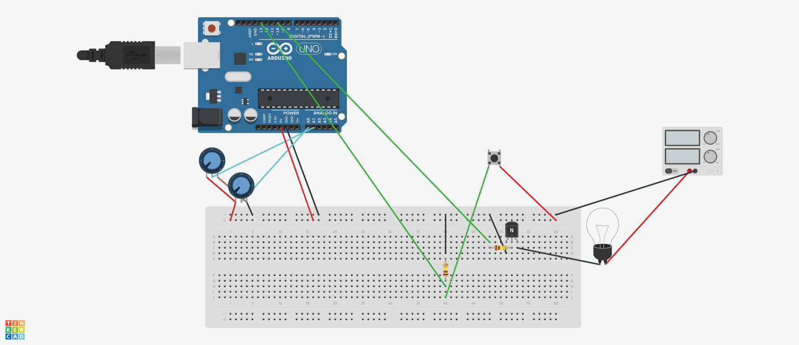

# Spiral plotter

## Installation

- [ZX](https://google.github.io/zx/)
- [Vpype](https://vpype.readthedocs.io/en/latest/)
- [AxiDraw CLI](https://axidraw.com/doc/cli_api/#installation)

## Bill of materials

- Raspberry Pi 4
- Arduino Mega
- Arcade button with integrated light
- [Screen](https://www.waveshare.com/10.1inch-hdmi-lcd-b-with-case.htm)
- [Arduino Mega shield](https://www.amazon.de/-/en/dp/B07DK6Y8CT)
- [Power indicator LED](https://www.amazon.de/-/en/dp/B08LDCXD89)
- [C14 panel mount power socket](https://www.amazon.de/-/en/dp/B0B53C3R36)
- [Panel mount USB socket](https://www.amazon.de/-/en/dp/B07C4QK1HJ)
- [Distribution plug](https://www.amazon.de/-/en/dp/B07GX662HZ)
- [Linear potentiometers](https://www.amazon.de/-/en/dp/B07ZHZ7DYN)
- [Power supply](https://www.amazon.de/-/en/dp/B09KNC7SDQ?th=1) for the status light in the button
- [Screws](https://www.amazon.de/-/en/dp/B0CBFFD747)

## PI

### kiosk mode

<https://pimylifeup.com/raspberry-pi-kiosk/>
<https://jonathanmh.com/raspberry-pi-4-kiosk-wall-display-dashboard/>

kiosk.service pahth: /lib/systemd/system/kiosk.service

## Arduino

### Wiring

## Issues

- A Raspberry Pi 4 [doesn't like a powered Arduino](https://forums.raspberrypi.com/viewtopic.php?t=266853)
- [Dispose your objects](https://threejs.org/docs/?q=ImprovedNoise#manual/en/introduction/How-to-dispose-of-objects) in Three.js
